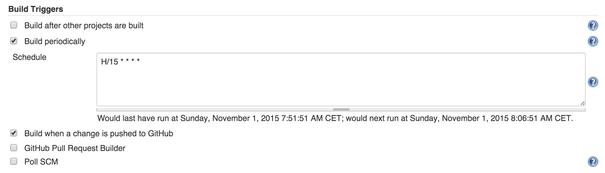

## About me:

* PHP, NodeJS, AngularJS, Python, Java, Scala;
* Living in the Netherlands, working at [XebiaLabs](https://xebialabs.com);
* Developing release automation product: XL Release.

---

## Inspired by


---

## Why do I want to talk about testing?

* TDD is great _when done properly_;
* [github.com/mkotsur/Restito](https://github.com/mkotsur/restito): mockito for REST interfaces;
* Have spent last 4 months rewriting Java business logic into Scala + Akka; 

---

## Akka is:

* ... about concurrency, parallelism and state;
* ... not just messages between actors;
* ... willing to help you with TestKit. 

---

## Let's talk about:

* Testing with Akka;
* Better testing with Akka;
* Problem-free testing with Akka.

---

## Testing sync code

```
// given

// when 

// then
```

---

## Testing sync code

```
// given

// when 

// eventually
```

---

## What does it mean to test actors?

---

<!-- .slide: data-background="./shapes/simple-actors.png" data-background-size="1000px" -->

---
<!-- .slide: data-background="./shapes/simple-actors-1.png" data-background-size="1000px" -->

---
<!-- .slide: data-background="./shapes/simple-actors-2.png" data-background-size="1000px" -->

---
<!-- .slide: data-background="./shapes/simple-actors-3.png" data-background-size="1000px" -->

---
<!-- .slide: data-background="./shapes/simple-actors-4.png" data-background-size="1000px" -->

---
<!-- .slide: data-background="./shapes/simple-actors-5.png" data-background-size="1000px" -->

---

<!-- .slide: data-background="./img/you-are-here.jpg" data-background-size="1000px" -->

---

<!-- .slide: data-background="./shapes/simple-actors.png" data-background-size="1000px" -->

---

```
object IncrementorActorMessages {

  case class Inc(i: Int)
  
}

class IncrementorActor extends Actor {

  var sum: Int = 0

  override def receive: Receive = {
    case Inc(i) => sum = sum + i
  }

}
    
```    

---

## Sync unit-testing via TestActorRef

* Works with `CallingThreadDispatcher`;
* Supports either message-sending style, or direct invocations.

---

```
it("should have sum = 0 by default") {
  val actorRef = TestActorRef[IncrementorActor]
  
  actorRef.underlyingActor.sum shouldEqual 0
}
```    
---

```   
it("should increment on new messages") {
  val actorRef = TestActorRef[IncrementorActor]

  actorRef ! Inc(2)
  actorRef.underlyingActor.sum shouldEqual 2

  actorRef ! Inc(3)
  actorRef.underlyingActor.receive(Inc(3))
}   
```

---

```
class LazyIncrementorActor extends Actor {

  var sum: Int = 0

  override def receive: Receive = {
    case Inc(i) =>
      Future {
        Thread.sleep(100)
        sum = sum + i
      }
  }

}
```

---

## Not always a good idea...


---

<!-- .slide: data-background="./shapes/simple-actors-3.png" data-background-size="1000px" -->

---

## Introducing test probes


---


```
 object IncrementorActorMessages {
   
   case class Inc(i: Int)
 
   case object Result
   
 }
```

---

``` 
 class IncrementorActor extends Actor {
 
   var sum: Int = 0
 
   override def receive: Receive = {
     
     case Inc(i) => sum = sum + i

     case Result => sender() ! sum
   }
 
 }
``` 


---

```
    it("should have sum = 0 by default") {
      val actorRef = system
      .actorOf(Props(classOf[IncrementorActor]))

      actorRef ! Result

      expectMsg(0)
    }
```    

---

```

    it("should increment on new messages") {
      val actorRef = system
      .actorOf(Props(classOf[IncrementorActor]))

      actorRef ! Inc(2)
      actorRef ! Result

      expectMsg(2)

      actorRef ! Inc(3)
      actorRef ! Result

      expectMsg(5)
    }
```    

---

## Akka test kit


* `testActor` probe and `ImplicitSender`;
* Bunch of assertions;
* Multiple probes;
* Event filter;
* Clustering SBT plugin;

---

## Test actors

    testActor // Immediately available
    
    with ImplicitSender // Places test actor in scope of the test
     
    val probe = TestProbe() // When you need more of those
    probe.ref // contains ActorRef

---

```
it("should increment on new messages 2") {
  val actorRef = system
  .actorOf(Props(classOf[IncrementorActor]))

  val probe = TestProbe()

  actorRef.tell(Inc(2), probe.ref)
  actorRef.tell(Result, probe.ref)

  probe.expectMsg(2)
}
```

---

## expectMsg family

```
def expectMsg[T](d: Duration, msg: T): T

def expectMsgPF[T](d: Duration)
                    (pf: PartialFunction[Any, T]): T

def expectMsgClass[T](d: Duration, c: Class[T]): T

def expectNoMsg(d: Duration) // blocks

```
   
---

## Fishing family
 
 
```
def receiveN(n: Int, d: Duration): Seq[AnyRef]

def fishForMessage(max: Duration, hint: String)
                (pf: PartialFunction[Any, Boolean]): Any
 
def receiveWhile[T](max: Duration, idle: Duration, n: Int)
                (pf: PartialFunction[Any, T]): Seq[T]
                 
```

---

## Awaits


```
def awaitCond(p: => Boolean, max: Duration, 
                    interval: Duration)

def awaitAssert(a: => Any, max: Duration, 
                    interval: Duration)
                    
// from ScalaTest

def eventually[T](fun: => T)
                    (implicit config: PatienceConfig): T
                    
```

---
    
## Ignores (stateful)
    
```
def ignoreMsg(pf: PartialFunction[AnyRef, Boolean])

def ignoreNoMsg()
```

---

## Death watch

```
val probe = TestProbe()

probe watch target
target ! PoisonPill

probe.expectTerminated(target) 
```

---

## Event filter

```
ConfigFactory.parseString(
    """akka.loggers = ["akka.testkit.TestEventListener"]"""
)

...

EventFilter.info(
    message = "Hello World!",
    occurrences = 1
).intercept {
    myActor ! DoSomething
}
```

---

## Supervision strategies


```
class MyActor extends Actor {
  
  override def supervisorStrategy: SupervisorStrategy = 
    OneForOneStrategy() {
        case _: FatalException => Escalate
        case _: ShitHappensException => Restart
    }
  
}

```

---

```
val myActorRef = TestActorRef[MyActor](MyActor.props())
val pf = myActorRef.underlyingActor
                    .supervisorStrategy.decider

pf(new FatalException()) should be (Escalate)
pf(new ShitHappensException()) should be (Restart)
```

---

## Clustering

* The Test Conductor. that coordinates and controls the nodes under test;
* The Multi Node Spec. that is a convenience wrapper for starting the TestConductor and letting all nodes connect to it;
* The SbtMultiJvm Plugin that starts tests in multiple JVMs possibly on multiple machines.

---

## Better testing with Akka

---

## Stopping/Starting Actor System

    class MyActorTest 
        extends TestKit(ActorSystem("test-system")) 
        with FunSpecLike {
    
      override protected def afterAll(): Unit = {
        super.afterAll()
        system.shutdown()
        system.awaitTermination()
      }
    }

---

## Becomes:

    class MyActorTest extends TestKit(ActorSystem("my-system")) 
        with AkkaTestBase {
        ...
    }

    trait AkkaTestBase 
        extends BeforeAndAfterAll 
        with FunSpecLike { this: TestKit with Suite =>
    
      override protected def afterAll() {
        super.afterAll()
        system.shutdown()
        system.awaitTermination()
      }
    }

---

## or

    class MyActorTest extends AkkaTestBase {
            ...
    }

    abstract class AkkaTestBase 
        extends TestKit(ActorSystem("test-system")) 
        with FunSpecLike 
        with BeforeAndAfterAll {
    
      override protected def afterAll() {
        super.afterAll()
        system.shutdown()
      }
    
    }
    
---

## Timeouts and dilation

```
akka.test.single-expect-default = 3 seconds

akka.test.timefactor = 10

...
```

---

## Settings extension

* Type safe,
* Convenient,
* Easy to modify for tests.

---

## Settings extension

    class Settings(...) extends Extension {
    
          object Jdbc {
            val Driver = config.getInt("app.jdbc.driver")
            val Url = config.getString("app.jdbc.url")
          }
      
    }

---

## Using settings

    class MyActor extends Actor {
      val settings = Settings(context.system)
      val connection = client.connect(
        settings.Jdbc.Driver, 
        settings.Jdbc.Url
      )
    }

---

## Changing settings for tests


    val config = ConfigFactory.parseString("""
        app.jdbc.driver = "org.h2.Driver"
        app.jdbc.url = "jdbc:h2:mem:repository"
    """)
        
    val system = ActorSystem("testsystem", config)  

---
<!-- .slide: data-background="./img/forest.JPG" data-background-size="1300px" -->

---

# The ultimate truth about asynchronous integration testing

---

... it doesn't matter how hard you try


---
<!-- .slide: data-background="./img/red-green.png" data-background-size="500px" -->

---

* Extract *all* timeouts into conf files. So that you can easily override them on Jenkins.
  * eventually.
  * Awaits.
  * Ask pattern.
   
---

## Run your tests on slow VM and different OS.
 
---
 
## Base your decisions on historical data.



---


---

## Don't hesitate to rewrite test.

---

## Don't hesitate to rewrite application code.

---

## Understand your thread pools

and make sure there are no deadlocks.

---

## Know who's blame is it: test, or application.

look for hints in the logs.

---

<!-- .slide: data-background="./img/green-green.png" data-background-size="500px" -->

---

Slides and code are available @
[http://github.com/mkotsur/akka-smart-testing](http://github.com/mkotsur/akka-smart-testing)
